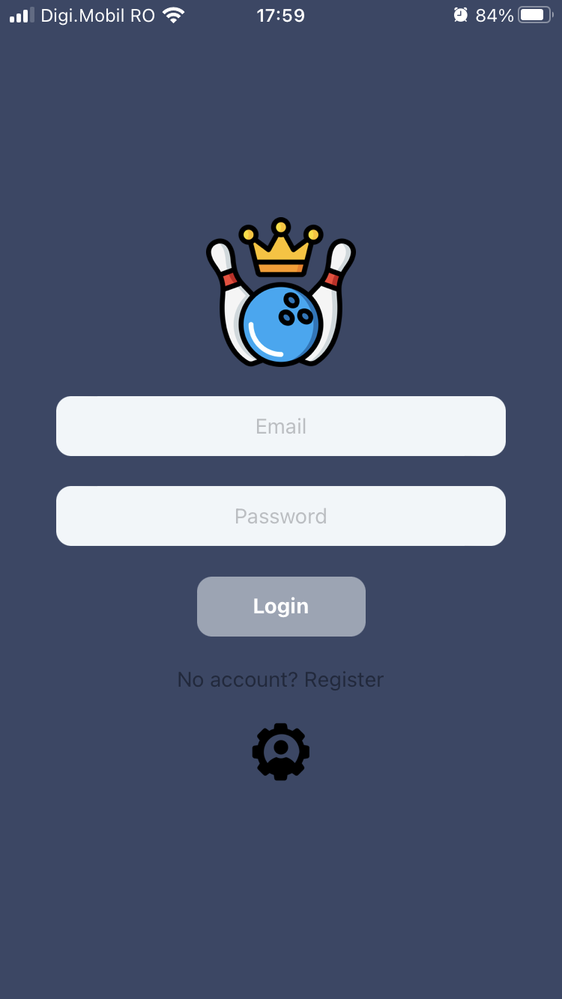
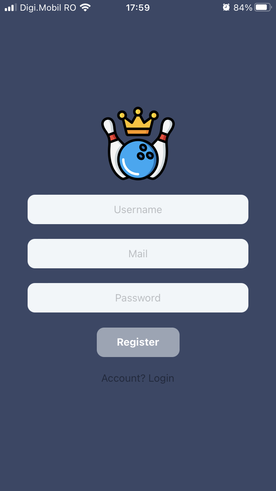
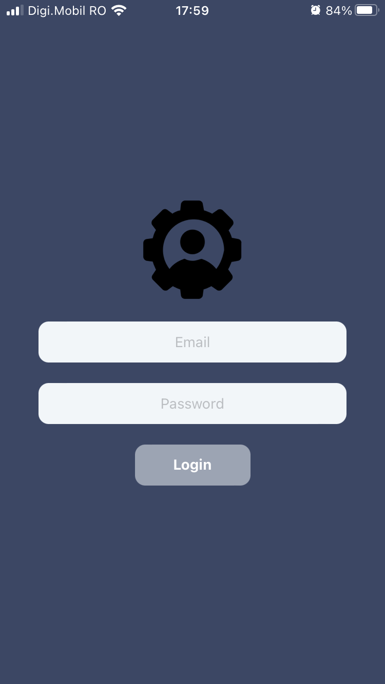
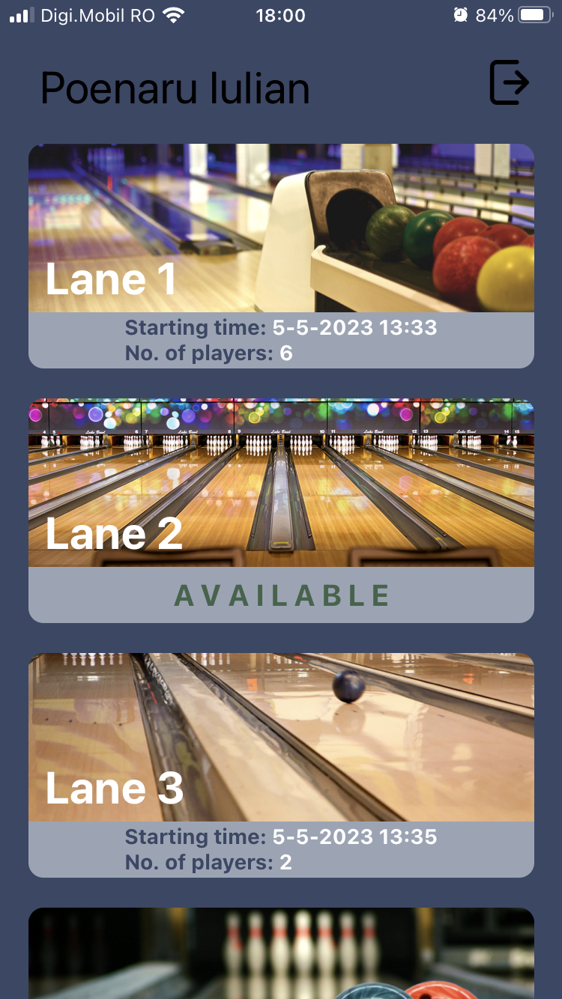
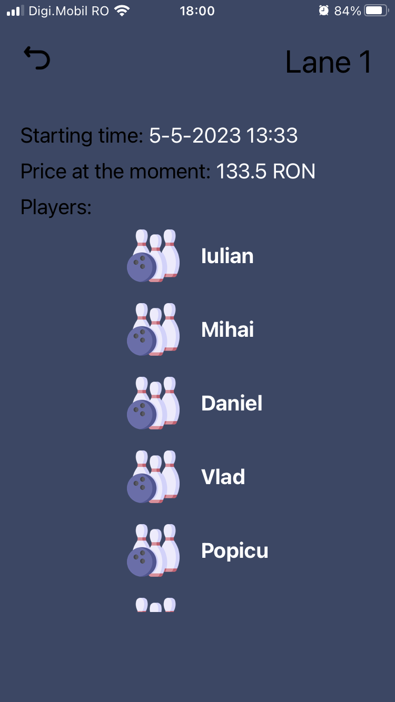
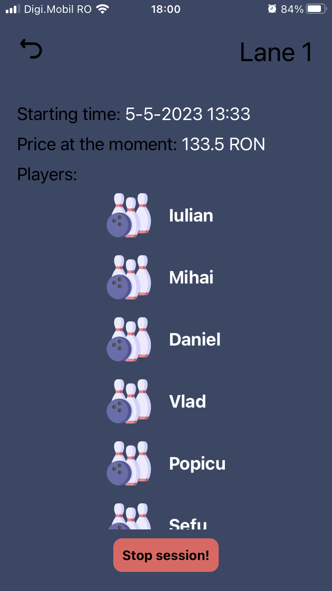
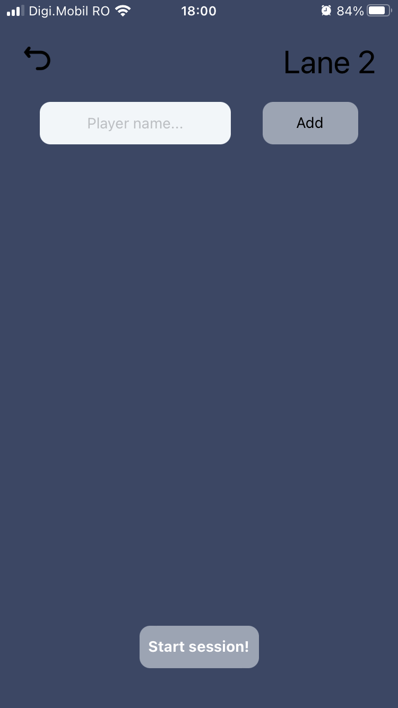

# Bowling lanes manager

The authentication and database is store locally and are managed using [Strapi](https://docs.strapi.io/dev-docs/quick-start). When the user enters the application he needs to log in or create an account.The third image is the admin login.

  
  
  

After the authentication, the user is presented with the lanes. There he can see the available lanes and the ones that are occupied at the moment. For every lane that is occupied there is presented the time when the session started, the price of the session at the moment (because the price grow with time) and the players that are in the current session.

  
  
  

As mentioned above, there is an admin side too. The admin can stop a current session or start a session by adding players.

  
  
  

The app presented above has the user and admin part merged together for easier implementation. The purpose of the app was to help me understand how to use Strapi so I know that the admin side should be on another application, separately from the client side. 

